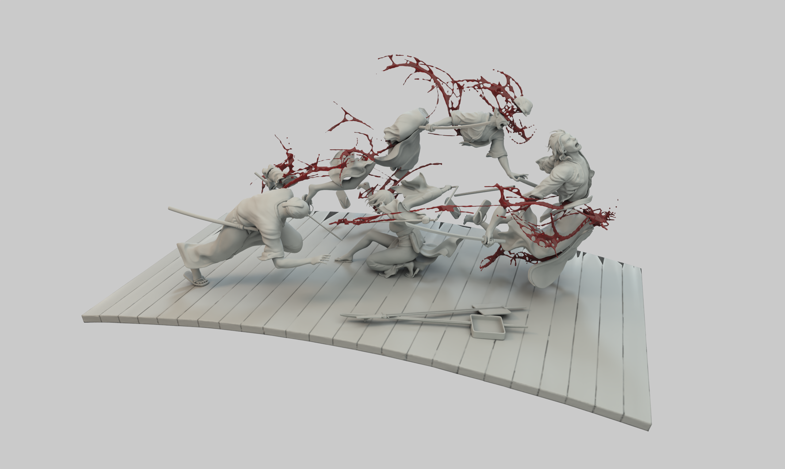
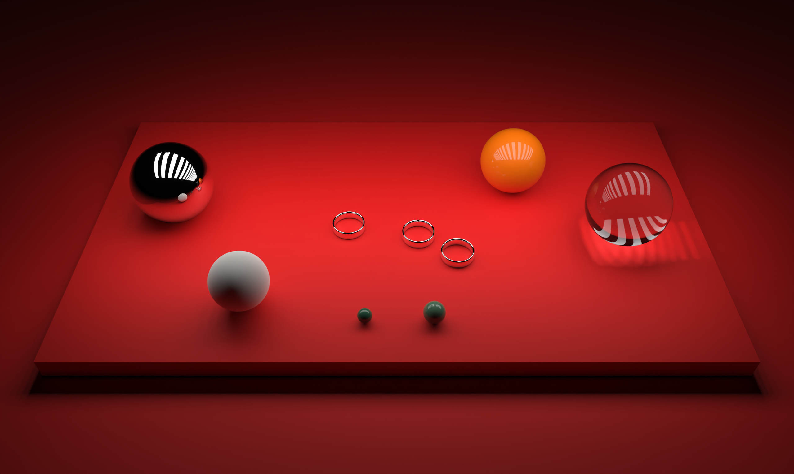

#  Raytracer



## 🚀 Project Overview

GLSL-based path tracer developed as a 2nd year student project at EPITECH. This renderer implements physically-based rendering techniques within fragment shaders, allowing for high-quality image synthesis directly on the GPU.

Built on the foundation of proven ray tracing methodologies, this project serves both as an educational exploration of modern rendering techniques and a practical implementation of computer graphics theory. The renderer efficiently balances visual fidelity with performance constraints, making advanced lighting simulation accessible within an academic context.

The implementation draws inspiration from established rendering techniques while adapting them to the constraints and opportunities of GLSL shader programming. This approach allows for the exploration of complex lighting phenomena while maintaining interactive feedback during development.

This project builds upon knowledge gained in core computer science fundamentals and extends it into specialized graphics programming domains, demonstrating the practical application of algorithms and data structures in visual computing.

## 💡 Features

### Core Rendering Technology

- Advanced unidirectional path tracer with physically-based rendering
- Two-level BVH (Bounding Volume Hierarchy) acceleration structure for efficient instancing
- Disney BSDF (Bidirectional Scattering Distribution Function) implementation
- Multiple importance sampling for variance reduction

### Material System

- Comprehensive texture mapping support:
    - Albedo
    - Metallic-Roughness
    - Normal
    - Emission
- Stochastic alpha testing for complex transparency

### Lighting Capabilities

- Versatile analytic light types:
    - Spherical
    - Rectangular
    - Directional
- Image-based lighting for realistic environment illumination

### Performance Optimizations

- Tile-based rendering for improved memory efficiency
- Integration with OpenImageDenoise for high-quality noise reduction

### Asset Support

- Full GLTF/GLB format compatibility
- Complete OBJ file format support
- MagicaVoxel-style homogeneous volume rendering

### Scene Configuration

- Flexible scene parsing powered by `LibConfig++`
- Intuitive scene description format
- Runtime scene parameter modifications

### Plugin Architecture

- Modular plugin system for extensibility:
    - GUI integration via ImGui
    - Cross-platform window management through `SDL2` or `SFML`
    - Easily extendable for custom functionality

## 🛠️ Installation

The raytracer project uses a Makefile-based build system and requires several external libraries. Follow the instructions below to set up your development environment properly.

### System Requirements

- A modern C++ compiler (GCC 9+, Clang 10+, or MSVC 2019+)
- OpenGL 3.2+ compatible GPU
- Make build system

## ⚙️ Usage

TODO...

## 🧩 Architecture

TODO...

## 🎨 Rendering Examples

Here are some example renders produced by the raytracer:




## 📚 Dependencies

The project relies on the following libraries:

|Library            |Purpose                            |Version    |
|-------------------|-----------------------------------|-----------|
|SDL2               |Window management, input handling  |2.0.12+    |
|SFML               |Alternative window management      |2.5.1+     |
|GL3W               |Modern OpenGL loading              |Latest     |
|GLEW               |OpenGL extension loading           |2.1.0+     |
|LibConfig++        |Scene configuration parsing        |1.7+       |
|OpenImageDenoise   |AI-accelerated denoising           |1.4.0+     |
|ImGui              |Graphical user interface           |Latest     |
|ImGuizmo           |3D manipulation widgets            |Latest     |
|StbImage           |Image loading/saving               |Latest     |

### Ubuntu/Debian

```bash
sudo apt update
sudo apt install libsdl2-dev libsfml-dev libglew-dev libconfig++-dev libopenimagedenoise-dev build-essential
```

### Fedora/CentOS

```bash
sudo dnf install SDL2-devel SFML-devel glew-devel libconfig-devel openimagedenoise-devel make gcc-c++
```

### macOS (using Homebrew)

```bash
brew install sdl2 sfml glew libconfig openimagedenoise
```

### Wwindows (using vcpkg)

```bash
vcpkg install sdl2 sfml glew libconfig openimagedenoise
```

## 🏗️ Build Instructions

1. Clone the repository:

```bash
git clone https://github.com/mallory-scotton/raytracer.git
cd raytracer
```

2. Build the project:

```bash
make
```

3. Run the raytracer:

```bash
./raytracer [sceneFile]
```

### Build Options

The Makefile supports several build options:

- `make plugins`: Only build the plugins
- `make clean`: Remove build artifacts
- `make fclean`: Remove all build artifacts
- `make re`: Rebuild the entire project

### Troubleshooting

If you encounter build issues:

1. Ensure all dependencies are properly installed
2. Check that your GPU supports OpenGL 3.2+
3. For linker errors, verify that library paths are correctly set
4. See the [GitHub Issues](https://github.com/mallory-scotton/raytracer/issues) page for known problems

## 🔧 Configuration

TODO...

## 📝 License

This project is licensed under the MIT License - see the [LICENSE](./LICENSE.md) file for details.

## 🤝 Contributing

Contributions are welcome! Feel free to open issues and submit pull requests to improve features or fix bugs. See the [CONTRIBUTING](./CONTRIBUTING.md) file for details.

## 📫 Contact

For questions or feedback, reach out at: `mallory.scotton@epitech.eu`

---

Happy ray tracing! 🌟
