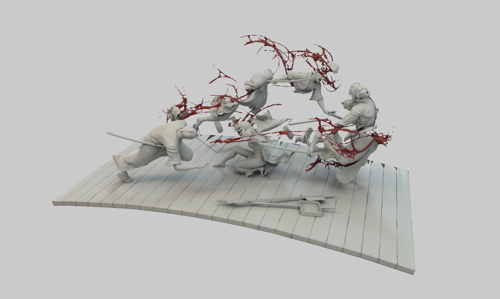
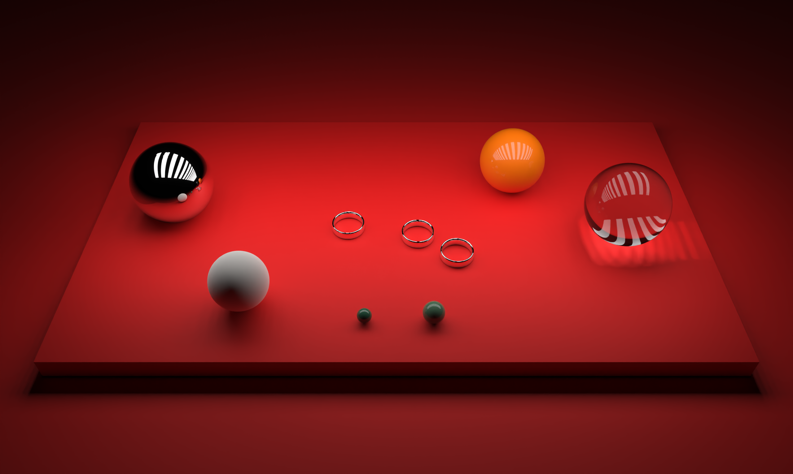
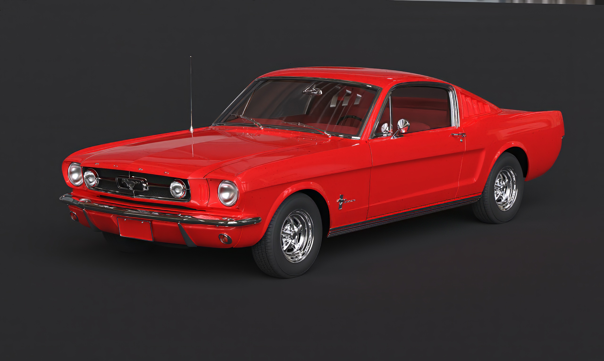
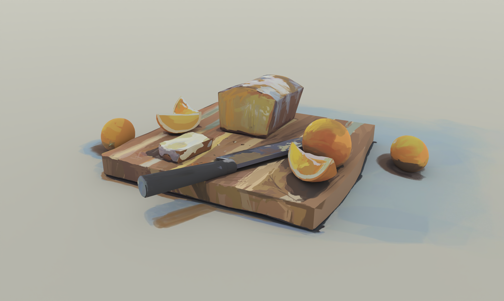
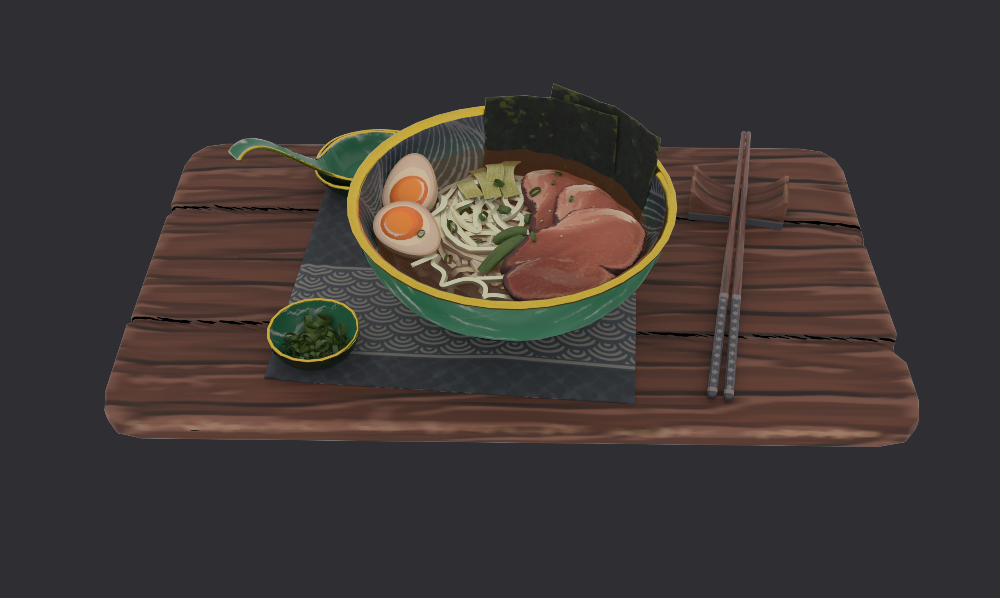
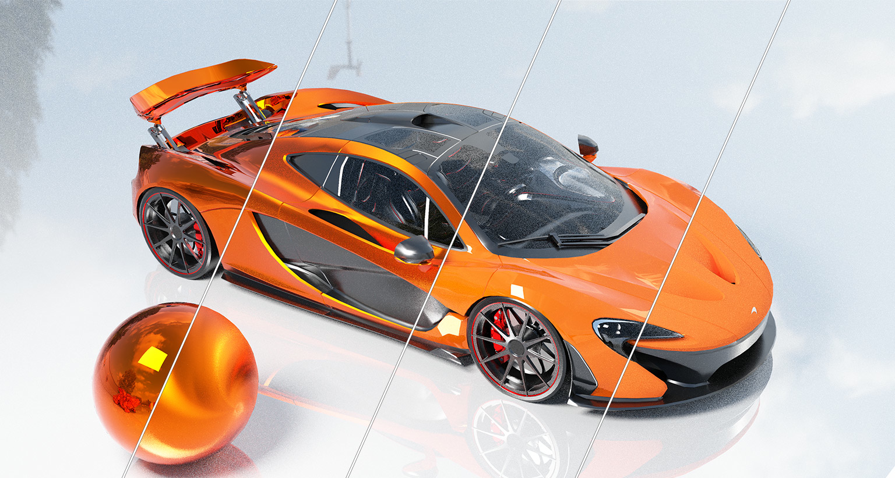

#  Raytracer



## 🚀 Project Overview

GLSL-based path tracer developed as a 2nd year student project at EPITECH. This renderer implements physically-based rendering techniques within fragment shaders, allowing for high-quality image synthesis directly on the GPU.

Built on the foundation of proven ray tracing methodologies, this project serves both as an educational exploration of modern rendering techniques and a practical implementation of computer graphics theory. The renderer efficiently balances visual fidelity with performance constraints, making advanced lighting simulation accessible within an academic context.

The implementation draws inspiration from established rendering techniques while adapting them to the constraints and opportunities of GLSL shader programming. This approach allows for the exploration of complex lighting phenomena while maintaining interactive feedback during development.

This project builds upon knowledge gained in core computer science fundamentals and extends it into specialized graphics programming domains, demonstrating the practical application of algorithms and data structures in visual computing.

## 💡 Features

### Built-in Primitives

- Complete set of parameterizable geometric shapes:
    - Sphere (perfect or deformed)
    - Cube (with adjustable dimensions)
    - Plane and infinite plane
    - Cylinder (capped or uncapped)
    - Cone (with variable apex angle)
    - Torus (with configurable inner/outer radius)
    - Morbius Strip (with configurable radius and half width)
    - Sierpinski Fractal (with adjustable dimensions)
    - Capsule (with configurable radius and height)
    - Disc (with configurable radius)
    - Ellipsoid (with configurable radii)
    - Pyramid (with adjustable base and height)
    - Tetrahedron
    - Octahedron
    - Dodecahedron
    - Icosahedron
    - Prism (with configurable base and height)
    - Helix (with configurable parameters)
    - Mesh (imported from file formats)
- Instanced primitives with individual transforms

### Core Rendering Technology

- Advanced unidirectional path tracer with physically-based rendering
- Two-level BVH (Bounding Volume Hierarchy) acceleration structure for efficient instancing
- Disney BSDF (Bidirectional Scattering Distribution Function) implementation
- Multiple importance sampling for variance reduction

### Material System

- Comprehensive texture mapping support:
    - Albedo
    - Metallic-Roughness
    - Normal
    - Emission
- Stochastic alpha testing for complex transparency

### Lighting Capabilities

- Versatile analytic light types:
    - Spherical
    - Rectangular
    - Directional
- Image-based lighting for realistic environment illumination

### Performance Optimizations

- Tile-based rendering for improved memory efficiency
- Integration with OpenImageDenoise for high-quality noise reduction

### Asset Support

- Full GLTF/GLB format compatibility
- Complete OBJ file format support
- MagicaVoxel-style homogeneous volume rendering

### Scene Configuration

- Flexible scene parsing powered by `LibConfig++`
- Intuitive scene description format
- Runtime scene parameter modifications

### Plugin Architecture

- Modular plugin system for extensibility:
    - GUI integration via ImGui
    - Cross-platform window management through `SDL2` or `SFML`
    - Easily extendable for custom functionality

## 🎨 Rendering Gallery

Here are some stunning example renders produced by the raytracer, showcasing its capabilities across different scenes and lighting conditions:


*Dream scene with complex lighting and materials*


*Architectural scene with global illumination*


*Character rendering with subsurface scattering*


*Complex geometry with volumetric lighting*


*High-detail mesh rendering with metallic materials*


*Automotive rendering with reflective surfaces*


*Still life with diverse material properties*


*Food scene with translucent materials*


*Material showcase demonstrating PBR capabilities*


*Abstract geometry with procedural textures*

## 🛠️ Installation

The raytracer project uses a Makefile-based build system and requires several external libraries. Follow the instructions below to set up your development environment properly.

### System Requirements

- A modern C++ compiler (GCC 9+, Clang 10+, or MSVC 2019+)
- OpenGL 3.2+ compatible GPU
- Make build system

## ⚙️ Usage

### Basic Command Line Usage

The raytracer can be executed in several ways:

```bash
# Run with default scene (first .scene file found in Scenes/ directory)
./raytracer

# Run with a specific scene file
./raytracer path/to/scene.scene

# Examples with provided scenes
./raytracer Scenes/Primitives.scene
./raytracer Scenes/Dragon.scene
./raytracer Scenes/Dream.scene
```

### Scene File Format

Scenes are defined using LibConfig++ syntax in `.scene` files. The format supports hierarchical configuration with the following main sections:

#### Renderer Configuration

```libconfig
renderer:
{
    resolution = {
        x: 1280;
        y: 720;
    };
    maxdepth = 8;              // Maximum ray bounce depth
    tilewidth = 320;           // Tile-based rendering width
    tileheight = 180;          // Tile-based rendering height
    envmapfile = "Assets/HDR/sunset.hdr";  // Environment map
    envmapintensity = 5.0;     // Environment lighting intensity
    enabledenoiser = true;     // OpenImageDenoise integration
    maxspp = 1024;            // Maximum samples per pixel
};
```

For comprehensive renderer configuration options, see the [Configuration](#-configuration) section.

#### Camera Setup

```libconfig
camera:
{
    position = { x: 0.0; y: 5.0; z: 10.0 };
    target = { x: 0.0; y: 0.0; z: 0.0 };
    up = { x: 0.0; y: 1.0; z: 0.0 };
    fov = 45.0;               // Field of view in degrees
    aperture = 0.0;           // Depth of field aperture
    focaldist = 10.0;         // Focal distance
};
```

#### Material Definitions

```libconfig
materials = (
    {
        name = "metal";
        type = "PBR";
        albedo = { r: 0.7; g: 0.7; b: 0.7 };
        metallic = 0.9;
        roughness = 0.1;
        emission = { r: 0.0; g: 0.0; b: 0.0 };
    },
    {
        name = "glass";
        type = "PBR";
        albedo = { r: 1.0; g: 1.0; b: 1.0 };
        metallic = 0.0;
        roughness = 0.0;
        transmission = 1.0;
        ior = 1.5;
    }
);
```

#### Primitive Objects

```libconfig
primitives = (
    {
        type = "sphere";
        material = "metal";
        position = { x: 0.0; y: 1.0; z: 0.0 };
        radius = 1.0;
    },
    {
        type = "cube";
        material = "glass";
        position = { x: 2.0; y: 1.0; z: 0.0 };
        scale = { x: 1.0; y: 1.0; z: 1.0 };
    }
);
```

#### Mesh Loading

```libconfig
meshes = (
    {
        file = "Assets/dragon/dragon.obj";
        material = "metal";
        name = "dragon";
        position = { x: 0.0; y: 0.0; z: 0.0 };
        rotation = { x: 0.0; y: 45.0; z: 0.0 };
        scale = { x: 1.0; y: 1.0; z: 1.0 };
    }
);
```

#### Lighting Setup

```libconfig
lights = (
    {
        type = "sphere";
        position = { x: 0.0; y: 10.0; z: 0.0 };
        color = { r: 1.0; g: 1.0; b: 1.0 };
        intensity = 100.0;
        radius = 1.0;
    },
    {
        type = "rect";
        position = { x: 0.0; y: 5.0; z: -5.0 };
        color = { r: 1.0; g: 0.8; b: 0.6 };
        intensity = 50.0;
        width = 2.0;
        height = 2.0;
    }
);
```

### Plugin System Usage

The raytracer uses a dynamic plugin architecture that loads `.rplugin` files from the `Plugins/` directory:

#### Available Plugin Types

- **Windowing Plugins**: `SDL2.rplugin`, `SFML.rplugin` - Handle window management and input
- **GUI Plugins**: `Gui.rplugin` - Provide ImGui-based user interface
- **Export Plugins**: Custom export functionality for different formats
- **Script Plugins**: Runtime scripting capabilities

#### Plugin Loading

Plugins are automatically discovered and loaded at startup. The system requires at least one windowing plugin and optionally supports GUI plugins for interactive control.

### Interactive Controls

When using GUI plugins, the raytracer provides:

- **Real-time scene parameter adjustment**
- **Camera controls** (WASD movement, mouse look)
- **Material property tweaking**
- **Lighting parameter modification**
- **Render settings adjustment**
- **Scene loading/switching**

### Export Options

The raytracer supports multiple output formats:

- **PNG**: High-quality image export
- **PPM**: Portable Pixmap format
- **HDR**: High Dynamic Range output
- **Real-time display**: Direct OpenGL framebuffer rendering

### Performance Tuning

Key parameters for optimization:

- **Tile size**: Adjust `tilewidth` and `tileheight` for your GPU memory
- **Max depth**: Balance quality vs. performance with ray bounce limits
- **Samples per pixel**: Control noise vs. render time trade-off
- **Denoiser**: Enable OpenImageDenoise for faster convergence
- **BVH settings**: Automatic optimization for scene complexity

## 🧩 Architecture

The raytracer implements a modular, plugin-based architecture designed for extensibility and performance. The system is structured around several core subsystems that work together to provide a complete rendering solution.

### Core System Design

#### Application Entry Point

The main application (`Main.cpp`) serves as a lightweight entry point that:
- Initializes the core `Raytracer` class with command-line arguments
- Handles top-level exception management
- Provides clean shutdown mechanisms

#### Context Management

The `Context` singleton (`Core/Context.cpp`) acts as the central coordination hub:
- **Resource Management**: Manages shader paths, asset directories, and scene files
- **OpenGL Integration**: Handles GL3W initialization and OpenGL context setup
- **Plugin Coordination**: Maintains plugin state and GUI availability flags
- **Scene Discovery**: Automatically discovers and catalogs available scene files
- **Renderer Lifecycle**: Manages renderer instantiation and cleanup

#### Core Raytracer Loop

The main `Raytracer` class (`Core/Raytracer.cpp`) implements the primary execution loop:
- **Plugin Discovery**: Scans `./Plugins/` directory for `.rplugin` files
- **Dynamic Loading**: Uses `DynamicLibrary` wrapper for plugin management
- **Plugin Validation**: Ensures exactly one windowing plugin is loaded
- **Render Loop**: Coordinates plugin updates, rendering, and presentation
- **Frame Timing**: Provides delta time for animation and performance metrics

### Plugin Architecture

#### Plugin Interface

All plugins implement the `IPlugin` interface (`Interfaces/IPlugin.hpp`):

```cpp
enum class Type {
    WINDOWING,  // Window management and input handling
    GUI,        // User interface overlays
    EXPORTER,   // Custom export functionality
    SCRIPTS     // Runtime scripting capabilities
};
```

#### Plugin Types

**Windowing Plugins** (`Plugins/SDL2/`, `Plugins/SFML/`):
- Handle window creation and event management
- Provide input handling (keyboard, mouse)
- Manage OpenGL context creation
- Support multiple backend implementations

**GUI Plugins** (`Plugins/Gui/`):
- Implement ImGui-based user interfaces
- Provide real-time parameter adjustment
- Support scene editing and material tweaking
- Enable interactive camera controls

**Custom Plugins** (Extensible):
- Export functionality for various formats
- Scripting integration for automated workflows
- Custom rendering passes or post-processing

### Rendering Pipeline

#### GPU-Based Path Tracing

The rendering system (`Core/Renderer.cpp`) implements a comprehensive GPU path tracer:

**Shader Organization**:
- `Stages/`: Vertex and fragment shader stages
- `Core/`: Main ray tracing and path integration logic
- `Intersection/`: Primitive and mesh intersection routines  
- `Materials/`: Disney BSDF and material evaluation
- `Lighting/`: Analytic light sampling and environment mapping

**Acceleration Structures**:
- **Two-Level BVH**: Instance-level and primitive-level optimization
- **GPU-Optimized**: Custom BVH layout for shader efficiency
- **Dynamic Rebuilding**: Supports animated and modified scenes

#### Tile-Based Rendering

The system implements efficient tile-based rendering:
- **Memory Optimization**: Reduces GPU memory pressure
- **Progressive Refinement**: Enables incremental quality improvement
- **Load Balancing**: Distributes work across GPU compute units

#### Denoising Integration

OpenImageDenoise integration provides:
- **AI-Accelerated Denoising**: Reduces required samples per pixel
- **Temporal Consistency**: Frame-to-frame stability
- **Quality/Performance Trade-offs**: Configurable denoising strength

### Scene Management

#### Scene Loading System

The `Loader` subsystem (`Loaders/Loader.cpp`) provides:
- **LibConfig++ Integration**: Hierarchical scene file parsing
- **Asset Management**: Texture, mesh, and material loading
- **GLTF/GLB Support**: Modern asset pipeline compatibility
- **OBJ Support**: Legacy mesh format compatibility

#### Scene Representation

Scenes are structured using several key components:

**Scene Graph** (`Components/Scene.hpp`):
- Hierarchical object organization
- Transform inheritance and instancing
- Material assignment and management
- Light distribution and organization

**Asset Pipeline**:
- **Texture Arrays**: Efficient GPU texture management
- **Mesh Buffers**: Optimized vertex and index storage
- **Material Database**: Centralized material parameter storage
- **Instance Management**: Efficient object duplication and variation

### Builder Pattern Implementation

The system uses builder patterns for complex object construction:

- **CameraBuilder** (`Builders/CameraBuilder.hpp`): Camera parameter construction
- **LightBuilder** (`Builders/LightBuilder.hpp`): Lighting setup and validation
- **MaterialBuilder** (`Builders/MaterialBuilder.hpp`): Material property management
- **MeshInstanceBuilder** (`Builders/MeshInstanceBuilder.hpp`): Mesh instantiation
- **PrimitiveBuilder** (`Builders/PrimitiveBuilder.hpp`): Primitive object creation
- **RendererOptionsBuilder** (`Builders/RendererOptionsBuilder.hpp`): Render settings

### Memory Management

#### GPU Memory Architecture

The system carefully manages GPU resources:
- **Texture Arrays**: Consolidated texture storage for efficient binding
- **Buffer Objects**: Optimized vertex, index, and uniform buffer management
- **Frame Buffers**: Efficient render target management and swapping

#### CPU-GPU Synchronization

Careful synchronization ensures:
- **Coherent State**: Scene modifications are properly synchronized
- **Efficient Transfers**: Minimizes expensive CPU-GPU memory transfers
- **Resource Lifecycle**: Proper cleanup and resource management

### Configuration System

#### LibConfig++ Integration

The configuration system provides:
- **Hierarchical Structure**: Nested configuration objects
- **Type Safety**: Compile-time type checking for configuration values
- **Error Handling**: Comprehensive parsing error reporting
- **Flexibility**: Support for arrays, objects, and primitive types

#### Runtime Configuration

Dynamic configuration support includes:
- **Hot Reloading**: Runtime scene file reloading
- **Parameter Tweaking**: Live adjustment of render parameters
- **Plugin Configuration**: Plugin-specific settings management

### Build System Architecture

#### Makefile-Based Build

The build system (`Makefile`) provides:
- **Modular Compilation**: Separate compilation of core and plugins
- **Dependency Management**: Automatic dependency resolution
- **Cross-Platform Support**: Linux, macOS, and Windows compatibility
- **Plugin Building**: Independent plugin compilation and linking

#### External Dependencies

Careful integration of external libraries:
- **OpenGL**: Graphics API abstraction and loading
- **ImGui**: Immediate mode GUI integration
- **OpenImageDenoise**: AI denoising integration
- **LibConfig++**: Configuration file parsing
- **SDL2/SFML**: Window management abstraction

This architecture provides a robust foundation for advanced ray tracing while maintaining extensibility and performance. The modular design allows for easy addition of new features, rendering techniques, and export formats without disrupting the core system.

## 📚 Dependencies

The project relies on the following libraries:

|Library            |Purpose                            |Version    |
|-------------------|-----------------------------------|-----------|
|SDL2               |Window management, input handling  |2.0.12+    |
|SFML               |Alternative window management      |2.5.1+     |
|GL3W               |Modern OpenGL loading              |Latest     |
|GLEW               |OpenGL extension loading           |2.1.0+     |
|LibConfig++        |Scene configuration parsing        |1.7+       |
|OpenImageDenoise   |AI-accelerated denoising           |2.3.0+     |
|ImGui              |Graphical user interface           |Latest     |
|ImGuizmo           |3D manipulation widgets            |Latest     |
|StbImage           |Image loading/saving               |Latest     |

### Ubuntu/Debian

```bash
sudo apt update
sudo apt install libsdl2-dev libsfml-dev libglew-dev libconfig++-dev libopenimagedenoise-dev build-essential
```

### Fedora/CentOS

```bash
sudo dnf install SDL2-devel SFML-devel glew-devel libconfig-devel openimagedenoise-devel make gcc-c++
```

### macOS (using Homebrew)

```bash
brew install sdl2 sfml glew libconfig openimagedenoise
```

### Windows (using vcpkg)

```bash
vcpkg install sdl2 sfml glew libconfig openimagedenoise
```

## 🏗️ Build Instructions

1. Clone the repository:

```bash
git clone https://github.com/mallory-scotton/raytracer.git
cd raytracer
```

2. Build the project:

```bash
make
```

3. Run the raytracer:

```bash
./raytracer [sceneFile]
```

### Build Options

The Makefile supports several build options:

- `make plugins`: Only build the plugins
- `make clean`: Remove build artifacts
- `make fclean`: Remove all build artifacts
- `make re`: Rebuild the entire project

### Troubleshooting

If you encounter build issues:

1. Ensure all dependencies are properly installed
2. Check that your GPU supports OpenGL 3.2+
3. For linker errors, verify that library paths are correctly set
4. See the [GitHub Issues](https://github.com/mallory-scotton/raytracer/issues) page for known problems

## 🔧 Configuration

The raytracer offers extensive configuration options through scene files, command-line parameters, and runtime adjustments.

### Scene File Configuration

Scene files use LibConfig++ syntax and support comprehensive customization:

#### Advanced Renderer Settings

```libconfig
renderer:
{
    // Resolution and Quality
    resolution = { x: 1920; y: 1080; };
    windowResolution = { x: 1280; y: 720; };
    independentRenderSize = true;
    
    // Ray Tracing Parameters
    maxdepth = 12;              // Maximum ray bounce depth
    maxspp = 2048;             // Maximum samples per pixel (-1 for infinite)
    RRDepth = 3;               // Russian Roulette depth threshold
    enableRR = true;           // Enable Russian Roulette optimization
    
    // Tile-Based Rendering
    tilewidth = 256;           // Rendering tile width
    tileheight = 256;          // Rendering tile height
    
    // Environment and Lighting
    envmapfile = "Assets/HDR/sunset.hdr";
    envmapintensity = 3.0;
    envmaprot = 0.0;           // Environment map rotation (degrees)
    enableEnvMap = true;
    enableUniformLight = false;
    uniformLightCol = { r: 0.3; g: 0.3; b: 0.3; };
    hideEmitters = false;
    
    // Background Settings
    enableBackground = true;
    transparentBackground = false;
    backgroundCol = { r: 0.0; g: 0.0; b: 0.0; };
    
    // Post-Processing
    enableDenoiser = true;
    denoiserFrameCnt = 30;     // Frames to accumulate before denoising
    enableTonemap = true;
    enableAces = true;         // ACES tone mapping
    simpleAcesFit = false;
    
    // Material and Rendering Features
    enableRoughnessMollification = false;
    roughnessMollificationAmt = 0.0;
    enableVolumeMIS = false;
    openglNormalMap = true;
    
    // Texture Management
    texArrayWidth = 4096;      // Texture array dimensions
    texArrayHeight = 4096;
};
```

#### Camera Configuration Options

```libconfig
camera:
{
    // Basic Positioning
    position = { x: 0.0; y: 5.0; z: 15.0; };
    target = { x: 0.0; y: 0.0; z: 0.0; };
    up = { x: 0.0; y: 1.0; z: 0.0; };
    
    // Lens Properties
    fov = 35.0;               // Field of view (degrees)
    aperture = 0.1;           // Depth of field aperture
    focaldist = 15.0;         // Focal distance
    
    // Animation (optional)
    animated = false;
    keyframes = (
        { time: 0.0; position: { x: 0.0; y: 5.0; z: 15.0; }; },
        { time: 5.0; position: { x: 10.0; y: 5.0; z: 10.0; }; }
    );
};
```

### Runtime Configuration

When GUI plugins are loaded, many parameters can be adjusted in real-time:

#### Render Settings Panel
- **Quality Controls**: Samples per pixel, max depth, tile size
- **Performance Toggles**: Russian Roulette, denoising, tone mapping
- **Environment Settings**: HDR environment maps, lighting intensity

#### Scene Editor
- **Object Manipulation**: Position, rotation, scale transforms
- **Material Editor**: PBR parameters, texture assignments
- **Lighting Controls**: Light intensity, color, positioning

#### Camera Controls
- **Interactive Movement**: WASD keys, mouse look
- **Focus Controls**: Aperture and focal distance adjustment
- **Animation Timeline**: Keyframe editing and playback

### Command Line Options

```bash
# Basic usage with scene file
./raytracer [scene_file.scene]

# Environment variables for paths
RAY_SHADER_PATH=./custom_shaders ./raytracer
RAY_ASSETS_PATH=./custom_assets ./raytracer
RAY_SCENES_PATH=./custom_scenes ./raytracer
```

### Performance Optimization Guidelines

#### GPU Memory Optimization
- **Tile Size**: Larger tiles (512x512) for high-end GPUs, smaller (128x128) for limited memory
- **Texture Arrays**: Reduce `texArrayWidth/Height` if experiencing memory issues
- **Max Depth**: Start with 8-12 bounces, adjust based on scene complexity

#### Quality vs Speed Trade-offs
- **Denoising**: Enable for faster convergence at lower sample counts
- **Russian Roulette**: Improves performance in complex scenes
- **Environment Mapping**: Disable for faster rendering when not needed

#### Scene-Specific Settings
- **Interior Scenes**: Higher max depth (12-16), enable uniform lighting
- **Exterior Scenes**: Medium depth (8-12), strong environment mapping
- **Material Studies**: Lower depth (4-8), focus on direct lighting

### Plugin Configuration

Plugins can be configured through their respective configuration files:

#### GUI Plugin Settings
- **Interface Layout**: Panel positioning and sizing
- **Update Frequency**: Real-time vs. on-demand updates
- **Export Options**: Image format preferences

#### Windowing Plugin Options
- **Input Mapping**: Custom key bindings
- **Display Settings**: Fullscreen, VSync, multi-monitor support
- **Performance Metrics**: Frame time display, GPU utilization

This flexible configuration system allows the raytracer to adapt to various hardware configurations and rendering requirements, from real-time preview to high-quality final renders.

## 📝 License

This project is licensed under the MIT License - see the [LICENSE](./LICENSE.md) file for details.

## 🤝 Contributing

Contributions are welcome! Feel free to open issues and submit pull requests to improve features or fix bugs. See the [CONTRIBUTING](./CONTRIBUTING.md) file for details.

## 📫 Contact

For questions or feedback, reach out at: `mallory.scotton@epitech.eu`

---

Happy ray tracing! 🌟
