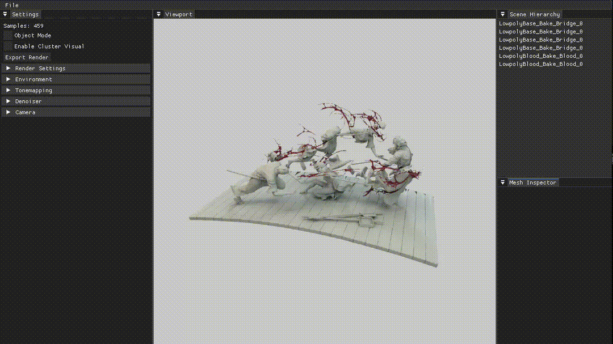

# Raytracer


[](./LICENSE.md)


## Overview

GLSL-based path tracer built as a 2nd-year student project at EPITECH. The rendering pipeline runs entirely on the GPU through fragment shaders. It does global illumination, depth of field, volumetrics, analytic lights, and IBL. Scenes are written in a LibConfig++ format and can be adjusted live through an ImGui interface.

## Features

### Primitives

Every shape takes individual transforms and material assignments:

- Sphere (perfect or deformed)
- Cube
- Plane / infinite plane
- Cylinder (capped or uncapped)
- Cone (variable apex angle)
- Torus (configurable inner/outer radius)
- Möbius Strip
- Sierpinski Fractal
- Capsule
- Disc
- Ellipsoid
- Pyramid
- Tetrahedron, Octahedron, Dodecahedron, Icosahedron
- Prism
- Helix
- Mesh (OBJ / GLTF / GLB)

### Rendering

- Unidirectional path tracer with physically-based rendering
- Two-level BVH acceleration structure for instancing
- Disney BSDF implementation
- Multiple importance sampling

### Materials

- PBR texture maps: albedo, metallic-roughness, normal, emission
- Stochastic alpha testing for transparency

### Lighting

- Analytic lights: sphere, rectangle, directional
- Image-based lighting (HDR environment maps)

### Performance

- Tile-based rendering
- OpenImageDenoise integration

### Asset support

- GLTF/GLB, OBJ
- MagicaVoxel homogeneous volume rendering

### Scene files

- LibConfig++ syntax in `.scene` files
- Runtime parameter modification

### Plugins

- Windowing: SDL2, SFML
- GUI: ImGui interface
- Extensible for custom plugins

## Gallery


*Pathtracer in motion*


*Dream scene*


*Bistro — global illumination*


*Jinx — subsurface scattering*


*Hyperion — volumetric lighting*


*Dragon — metallic mesh*


*Mustang — reflective surfaces*


*Still life — mixed materials*


*Ramen — translucent materials*


*PBR material showcase*


*Abstract geometry*

## Installation

### Requirements

- GCC 9+, Clang 10+, or MSVC 2019+
- OpenGL 3.2+ compatible GPU
- Make

### Dependencies

| Library | Purpose | Version |
|---------|---------|---------|
| SDL2 | Window management, input | 2.0.12+ |
| SFML | Alternative windowing | 2.5.1+ |
| GL3W | OpenGL loader | Latest |
| GLEW | OpenGL extension loader | 2.1.0+ |
| LibConfig++ | Scene file parsing | 1.7+ |
| OpenImageDenoise | AI denoising | 2.3.0+ |
| ImGui | GUI | Latest |
| ImGuizmo | 3D widgets | Latest |
| StbImage | Image I/O | Latest |

#### Ubuntu / Debian

```bash
sudo apt update && sudo apt install libsdl2-dev libsfml-dev libglew-dev libconfig++-dev libopenimagedenoise-dev build-essential
```

#### Fedora / CentOS

```bash
sudo dnf install SDL2-devel SFML-devel glew-devel libconfig-devel openimagedenoise-devel make gcc-c++
```

#### macOS

```bash
brew install sdl2 sfml glew libconfig openimagedenoise
```

#### Windows

```bash
vcpkg install sdl2 sfml glew libconfig openimagedenoise
```

### Build

```bash
git clone https://github.com/mallory-scotton/raytracer.git
cd raytracer
make
```

Additional targets:

| Target | Effect |
|--------|--------|
| `make plugins` | Build only the plugins |
| `make clean` | Remove object files |
| `make fclean` | Full clean |
| `make re` | Clean rebuild |

### Troubleshooting

1. Verify all dependencies are installed.
2. Confirm your GPU supports OpenGL 3.2+.
3. For linker errors, check that library paths are set correctly.
4. See the [GitHub Issues](https://github.com/mallory-scotton/raytracer/issues) page for known problems.

## Usage

```bash
# Default scene (first .scene file in Scenes/)
./raytracer

# Specific scene
./raytracer Scenes/Dragon.scene
```

Environment variable overrides:

```bash
RAY_SHADER_PATH=./custom_shaders ./raytracer
RAY_ASSETS_PATH=./custom_assets ./raytracer
RAY_SCENES_PATH=./custom_scenes ./raytracer
```

### Scene file format

Scenes use LibConfig++ syntax in `.scene` files.

#### Renderer

```libconfig
renderer:
{
    resolution = { x: 1280; y: 720; };
    maxdepth = 8;
    tilewidth = 320;
    tileheight = 180;
    envmapfile = "Assets/HDR/sunset.hdr";
    envmapintensity = 5.0;
    enabledenoiser = true;
    maxspp = 1024;
};
```

Full renderer options:

```libconfig
renderer:
{
    // Resolution
    resolution = { x: 1920; y: 1080; };
    windowResolution = { x: 1280; y: 720; };
    independentRenderSize = true;

    // Ray tracing
    maxdepth = 12;
    maxspp = 2048;             // -1 for infinite
    RRDepth = 3;
    enableRR = true;

    // Tiling
    tilewidth = 256;
    tileheight = 256;

    // Environment
    envmapfile = "Assets/HDR/sunset.hdr";
    envmapintensity = 3.0;
    envmaprot = 0.0;
    enableEnvMap = true;
    enableUniformLight = false;
    uniformLightCol = { r: 0.3; g: 0.3; b: 0.3; };
    hideEmitters = false;

    // Background
    enableBackground = true;
    transparentBackground = false;
    backgroundCol = { r: 0.0; g: 0.0; b: 0.0; };

    // Post-processing
    enableDenoiser = true;
    denoiserFrameCnt = 30;
    enableTonemap = true;
    enableAces = true;
    simpleAcesFit = false;

    // Misc
    enableRoughnessMollification = false;
    roughnessMollificationAmt = 0.0;
    enableVolumeMIS = false;
    openglNormalMap = true;
    texArrayWidth = 4096;
    texArrayHeight = 4096;
};
```

#### Camera

```libconfig
camera:
{
    position = { x: 0.0; y: 5.0; z: 10.0; };
    target = { x: 0.0; y: 0.0; z: 0.0; };
    up = { x: 0.0; y: 1.0; z: 0.0; };
    fov = 45.0;
    aperture = 0.0;
    focaldist = 10.0;

    // Optional keyframe animation
    animated = false;
    keyframes = (
        { time: 0.0; position: { x: 0.0; y: 5.0; z: 15.0; }; },
        { time: 5.0; position: { x: 10.0; y: 5.0; z: 10.0; }; }
    );
};
```

#### Materials

```libconfig
materials = (
    {
        name = "metal";
        type = "PBR";
        albedo = { r: 0.7; g: 0.7; b: 0.7 };
        metallic = 0.9;
        roughness = 0.1;
    },
    {
        name = "glass";
        type = "PBR";
        albedo = { r: 1.0; g: 1.0; b: 1.0 };
        metallic = 0.0;
        roughness = 0.0;
        transmission = 1.0;
        ior = 1.5;
    }
);
```

#### Primitives

```libconfig
primitives = (
    {
        type = "sphere";
        material = "metal";
        position = { x: 0.0; y: 1.0; z: 0.0 };
        radius = 1.0;
    },
    {
        type = "cube";
        material = "glass";
        position = { x: 2.0; y: 1.0; z: 0.0 };
        scale = { x: 1.0; y: 1.0; z: 1.0 };
    }
);
```

#### Meshes

```libconfig
meshes = (
    {
        file = "Assets/dragon/dragon.obj";
        material = "metal";
        name = "dragon";
        position = { x: 0.0; y: 0.0; z: 0.0 };
        rotation = { x: 0.0; y: 45.0; z: 0.0 };
        scale = { x: 1.0; y: 1.0; z: 1.0 };
    }
);
```

#### Lights

```libconfig
lights = (
    {
        type = "sphere";
        position = { x: 0.0; y: 10.0; z: 0.0 };
        color = { r: 1.0; g: 1.0; b: 1.0 };
        intensity = 100.0;
        radius = 1.0;
    },
    {
        type = "rect";
        position = { x: 0.0; y: 5.0; z: -5.0 };
        color = { r: 1.0; g: 0.8; b: 0.6 };
        intensity = 50.0;
        width = 2.0;
        height = 2.0;
    }
);
```

### Interactive controls

When the GUI plugin is loaded:

- Camera: WASD movement, mouse look, aperture and focal distance controls
- Scene: live object transforms, material editor, lighting controls
- Render: samples per pixel, max depth, tile size, denoising toggle

### Performance tips

| Scenario | Setting |
|----------|---------|
| Limited GPU memory | Small tiles (128x128), lower `texArrayWidth/Height` |
| High-end GPU | Large tiles (512x512) |
| Interior scenes | `maxdepth` 12-16, enable uniform lighting |
| Exterior scenes | `maxdepth` 8-12, strong environment map |
| Material preview | `maxdepth` 4-8, direct lighting only |

## Architecture

The renderer uses a plugin-based core for GPU rendering, scene management, and runtime configuration.

### Core systems

`Main.cpp` is the entry point. It initializes `Raytracer` and handles top-level exceptions.

`Core/Context.cpp` is a singleton. It holds shader paths, asset directories, GL3W state, plugin flags, and the renderer's lifetime.

`Core/Raytracer.cpp` runs the main loop. It scans `./Plugins/` for `.rplugin` files, loads them through `DynamicLibrary`, enforces exactly one windowing plugin, and then ticks plugins, renders, and presents each frame.

### Plugin interface

All plugins implement `IPlugin` (`Interfaces/IPlugin.hpp`):

```cpp
enum class Type {
    WINDOWING,  // window creation, input, OpenGL context
    GUI,        // ImGui overlays
    EXPORTER,   // output formats
    SCRIPTS     // runtime scripting
};
```

Windowing plugins (`Plugins/SDL2/`, `Plugins/SFML/`) handle window and event management and own the OpenGL context. The GUI plugin (`Plugins/Gui/`) provides the ImGui interface with live parameter editing and camera controls. Custom plugins can add export formats, scripting, or post-processing passes.

### Rendering pipeline

Shaders are organized under:

| Directory | Contents |
|-----------|----------|
| `Stages/` | Vertex / fragment stage boilerplate |
| `Core/` | Path integration logic |
| `Intersection/` | Primitive and mesh intersectors |
| `Materials/` | Disney BSDF |
| `Lighting/` | Analytic lights and IBL |

A two-level BVH handles acceleration: instance-level on top, primitive-level per mesh. The layout is tuned for shader access patterns and can be rebuilt at runtime for animated or modified scenes.

Tile-based rendering reduces GPU memory pressure and lets the image refine progressively. OpenImageDenoise runs after a configurable number of accumulated frames, cutting the sample count needed for a clean result.

### Scene loading

`Loaders/Loader.cpp` parses `.scene` files via LibConfig++, loads textures and meshes, and hands off a complete `Scene` to the renderer. The loader handles both GLTF/GLB and OBJ.

### Builder pattern

Complex objects use typed builders:

- `CameraBuilder`, `LightBuilder`, `MaterialBuilder`
- `MeshInstanceBuilder`, `PrimitiveBuilder`, `RendererOptionsBuilder`

### GPU memory

Textures are packed into arrays for efficient binding. Vertex/index data and uniforms use dedicated buffer objects. Scene changes batch and transfer in a single pass to keep the CPU-GPU sync path narrow.

## License

MIT. See [LICENSE](./LICENSE.md).

## Contributing

Issues and pull requests are welcome. See [CONTRIBUTING](./CONTRIBUTING.md) for details.

## Contact

`mscotton.pro@gmail.com`

---

Happy ray tracing!
